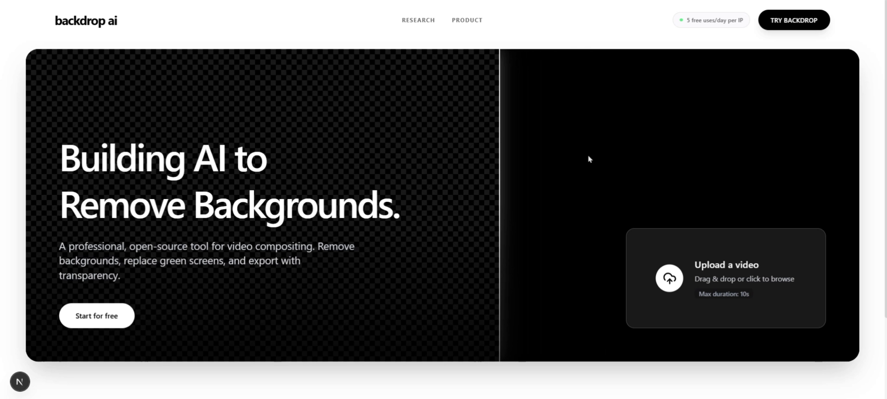
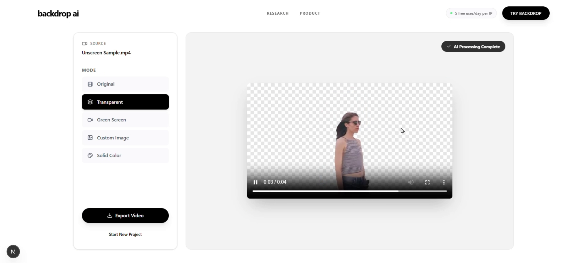
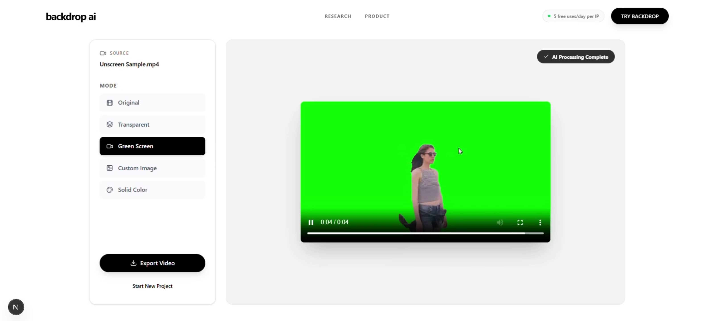
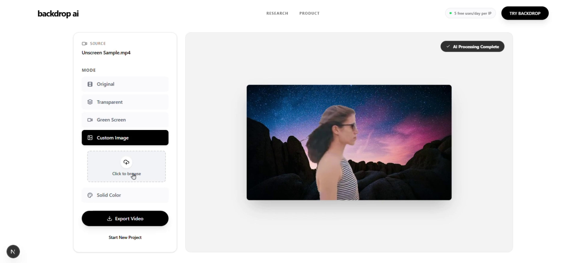
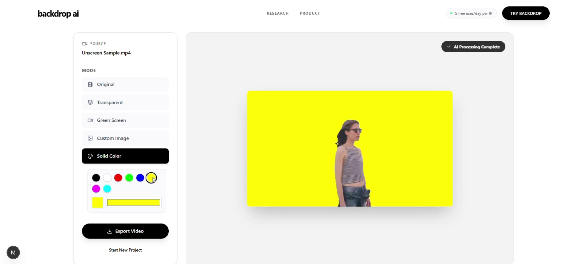

# Backdrop AI 🎬


AI-powered video background removal tool implementing [BiRefNet](https://github.com/ZhengPeng7/BiRefNet) for precise semantic segmentation. This project explores real-time video compositing with transparent backgrounds, green screen replacement, and custom backdrop rendering.

[](https://drive.google.com/file/d/1jzBkBHyNem_tf2x5ujGLKCavZ89ZFg8p/view?usp=sharing)

## Core Technology

### Backend Architecture

- **Model**: BiRefNet (Bilateral Reference Network) for salient object segmentation
- **Framework**: FastAPI with async processing pipeline
- **Inference**: PyTorch + CUDA acceleration (half-precision)
- **Video Processing**: OpenCV + MoviePy for frame-level manipulation
- **Output**: WebM (VP9) with alpha channel + MP4 preview

### Frontend Stack

- **Framework**: Next.js 16 with React 19
- **Type Safety**: TypeScript with strict mode
- **Styling**: Tailwind CSS v4 (PostCSS)
- **State Management**: React hooks for upload/processing flow

### Model Implementation

```python
# BiRefNet inference pipeline
- Resolution: 512x512 (optimized for speed)
- Batch Processing: 4 frames per inference pass
- Threshold: 0.5 for binary mask generation
- Half-precision (FP16) for 2x memory efficiency
```

## Quick Start

### Prerequisites

- Python 3.8+
- Node.js 18+
- CUDA-compatible GPU (recommended)

### Backend Setup

```bash
cd backend
pip install -r requirements.txt
python app.py
```

### Frontend Setup

```bash
cd frontend
npm install
npm run dev
```

## Application Screenshots

<p align="center">
  
  
</p>
<p align="center">
  
  
  
</p>

## Research Notes

This implementation focuses on:

1. **Real-time inference** through batched frame processing
2. **Memory optimization** via half-precision and efficient tensor ops
3. **Practical deployment** balancing accuracy vs. speed (512px resolution)

The BiRefNet model demonstrates strong performance on video data despite being trained primarily on image datasets, likely due to its bilateral reference mechanism handling temporal consistency implicitly.

## Architecture Overview


## Technical Challenges

- **Alpha channel encoding**: VP9 codec for WebM transparency support
- **Frame synchronization**: Maintaining consistent FPS across processing pipeline
- **Background composition**: Real-time preview with multiple backdrop modes

## Future Work

- [ ] Temporal consistency optimization (optical flow integration)
- [ ] Edge refinement using trimap generation
- [ ] Multi-resolution inference cascade
- [ ] Client-side WASM inference for privacy

## Acknowledgments

Built upon [BiRefNet](https://arxiv.org/abs/2401.03407) by Zheng et al. Special thanks to the open-source computer vision community.

---

**Note**: This is a research implementation. For production use, consider edge case handling and additional optimization.
